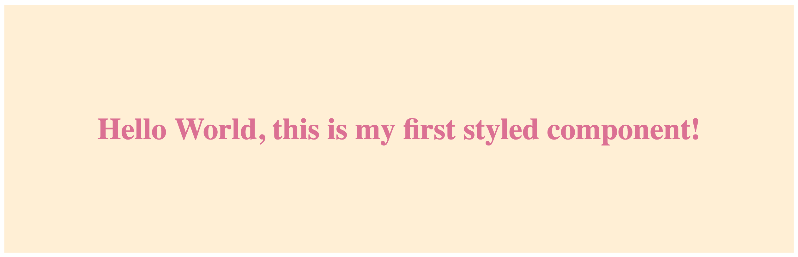

# 💅 – Styled Stencils – A library for your web components

A [Styled Components](https://github.com/styled-components/styled-components) like library for [StencilJS](https://stenciljs.com/)

---

[](https://travis-ci.org/fifthbeat/styled-stenciljs)
[](https://codeclimate.com/github/fifthbeat/styled-stenciljs/maintainability)
[](https://david-dm.org/fifthbeat/styled-stenciljs)
[](https://badge.fury.io/js/styled-stencil)

## Intro

This project is meant to handle fast production and easy maintenance, this is not an overall solution is a way for us for fasten our work and grant quality during all the development project.

_Contributions_ and _feedbacks_ are welcome.

## What it does

Basically it gives you the flexibility of **CSS** in the power engine of **JS**. Helps keep clean your code and avoid spaghetti code and css files long like script rolls.

## Install

```bash
yarn add styled-stencils
```

or if you have time to spare

```bash
npm install styled-stencil
```

## Example

Use your styled components in `JSX` as you would have done with normal components

```jsx
import {Component} from '@stencil/core';
import styled from 'styled-stencil';

const Background = styled.section`
  padding: 4em;
  background: papayawhip;
`;

const Title = styled.h1`
  font-size: 1.5em;
  text-align: center;
  color: ${(props) => props.color};
`;

@Component({
  tag: 'my-component'
})
export class MyComponent {
  render() {
    return (
      <Background>
        <Title color="palevioletred">Hello World, this is my first styled component!</Title>
      </Background>
    );
  }
}
```

And here the result you'll se on page. Same as styled-components 😉



## Requirements

- Node >= 10.1

## Author

- Nicola Bertelloni – [https://github.com/wanbinkimoon](https://github.com/wanbinkimoon)

## Acknowledgments

- [Michael Auderer](https://github.com/michaelauderer) who made a first concept of [this](https://github.com/michaelauderer/stencil-styled-components)
- [Max Stoiber](https://github.com/mxstbr) who had the very first idea of styled components – as long as I know.
